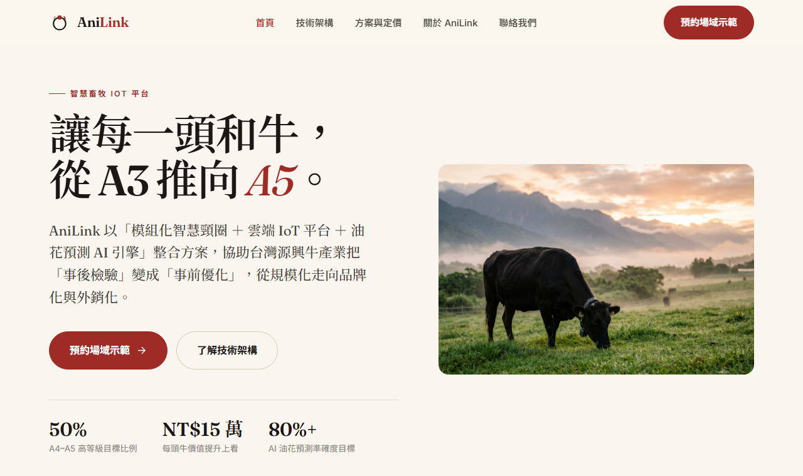
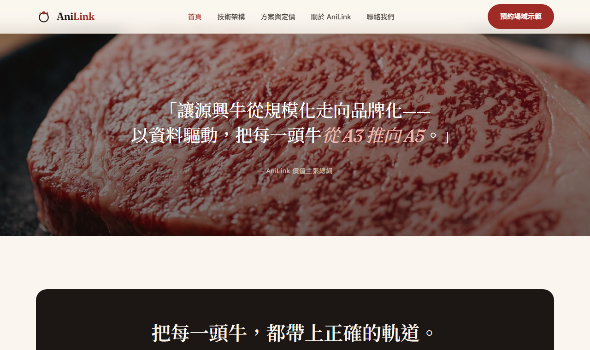

# AniLink 智物聯科技 — 官方網站

> 台灣和牛的智慧夥伴 — 以「模組化智慧頸圈 ＋ 雲端 IoT 平台 ＋ 油花預測 AI 引擎」整合方案，協助源興牛產業從規模化走向品牌化。

<p align="center">
  
</p>

本專案為《電子商務概論期末報告 — 智慧畜牧 IoT 平台（台灣和牛版）》衍生的品牌官方網站，
是一個**純 HTML / CSS / JavaScript** 的多頁式靜態網站，無需安裝套件、無建置步驟，雙擊 `index.html` 即可開啟。

---

## ✨ 特色

- **明亮編輯雜誌風**：米白底（`#FAF6EF`）＋ 大量留白 ＋ 精緻襯線標題（Fraunces + Noto Serif TC）＋ 一抹和牛紅（`#9E2B25`）。
- **多頁式完整官網**：首頁、技術架構、方案與定價、關於、聯絡，共 5 頁，共用一套設計系統。
- **視差背景區塊**：品牌定位帶、價值引言、願景三段採固定背景圖視差捲動（桌機），手機自動退回一般捲動。
- **程式繪製的資料圖表**：即時儀表板、生命階段時間軸、多模態 AI 融合圖、模組化價格表、KPI 數字滾動，全部以 CSS／SVG 精準繪製（非圖片）。
- **漸進增強**：進場動畫、數字滾動為純加分效果；關閉 JavaScript 時內容與數字仍完整可讀（`<noscript>` 後備 ＋ HTML 內建真實數值）。
- **響應式（RWD）**：桌機 / 平板 / 手機自適應，含漢堡選單。
- **無障礙友善**：語意化結構、`aria-label`、尊重「減少動態」偏好。

<p align="center">
  
</p>

---

## 🗂️ 專案結構

```
.
├── index.html            首頁（Hero、四大痛點、解決方案＋儀表板、KPI、產品線、為何和牛）
├── technology.html       技術架構（智慧頸圈、雲端平台、LifeStage、多模態 AI 油花預測）
├── pricing.html          方案與定價（套餐、模組化 SaaS、ROI、追溯費說明）
├── about.html            關於 AniLink（公司、源興牛故事、市場、STP、創新、願景）
├── contact.html          聯絡我們（預約表單、聯絡資訊、合作流程）
├── css/
│   └── styles.css        共用設計系統（色彩 / 字體 / 元件 / 視差 / RWD）
├── js/
│   └── main.js           共用互動（行動選單、捲動進場、數字滾動、表單）
├── images/               11 張品牌圖片
├── screenshots/          README 預覽圖
├── favicon.svg           網站圖示
└── 圖片提示詞.md          各圖片的 nanobanana（Gemini）生成提示詞
```

---

## 🚀 本機檢視

直接用瀏覽器開啟 `index.html` 即可。若想避免少數瀏覽器的本機限制，可開一個本機伺服器：

```bash
# 任選一種
python -m http.server 8080
npx serve .
```

再開 http://localhost:8080

---

## 🌐 部署（GitHub Pages）

此為純靜態站，`index.html` 位於根目錄，可直接用 GitHub Pages 上線：

1. 進入 **Settings → Pages**。
2. **Source** 選 `Deploy from a branch`，分支選 `main`、資料夾選 `/ (root)`。
3. 儲存後等待數分鐘，即可透過 `https://<使用者>.github.io/AniLink/` 瀏覽。

也可拖拉本資料夾至 Netlify / Vercel / Cloudflare Pages，無需任何建置指令。

---

## 🛠️ 技術

| 項目 | 說明 |
|------|------|
| 結構 | 語意化 HTML5 |
| 樣式 | 原生 CSS（CSS 變數設計系統、Grid／Flex、`background-attachment: fixed` 視差） |
| 互動 | 原生 JavaScript（IntersectionObserver 進場動畫與數字滾動、行動選單、表單驗證） |
| 字體 | Google Fonts：Fraunces、Noto Serif TC、Noto Sans TC、Inter |
| 圖片 | 由 nanobanana（Gemini 影像模型）依 `圖片提示詞.md` 生成 |

---

## 📝 備註

- 聯絡表單為**前端展示**，送出僅顯示成功訊息；實際上線需串接後端或表單服務（如 Formspree、Netlify Forms）。
- 內容數據均取自期末報告原文，AI 油花預測準確度採分階段揭露（55–65% → 75–82% → 85%+），未誇大。
- 本專案為課程作業／教學案例用途。
